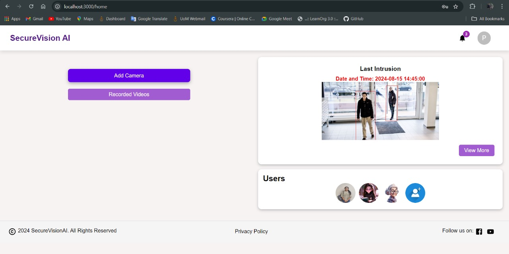

# Dashboard

The dashboard allows users to:

- View all added camera footage.
- Receive intrusion alerts.
- Access recorded videos through a dedicated button.
- Add new users to the system using the 'Add User' button.
- Start or stop the recording using the start/stop toggle button.
- Add new cameras by clicking on the 'Add Camera' button.

