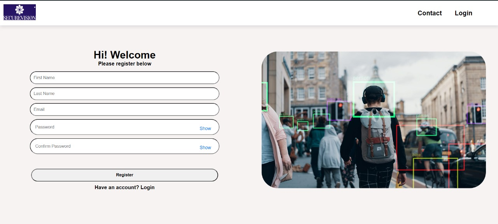

# Register Page

The User Registration window allows new users to create an account by entering basic details such as Full Name, email, and password. The interface ensures a smooth registration process with clear prompts and validations, providing secure access to the system upon successful registration.

After successful registration, the user will be redirected to the login page.
